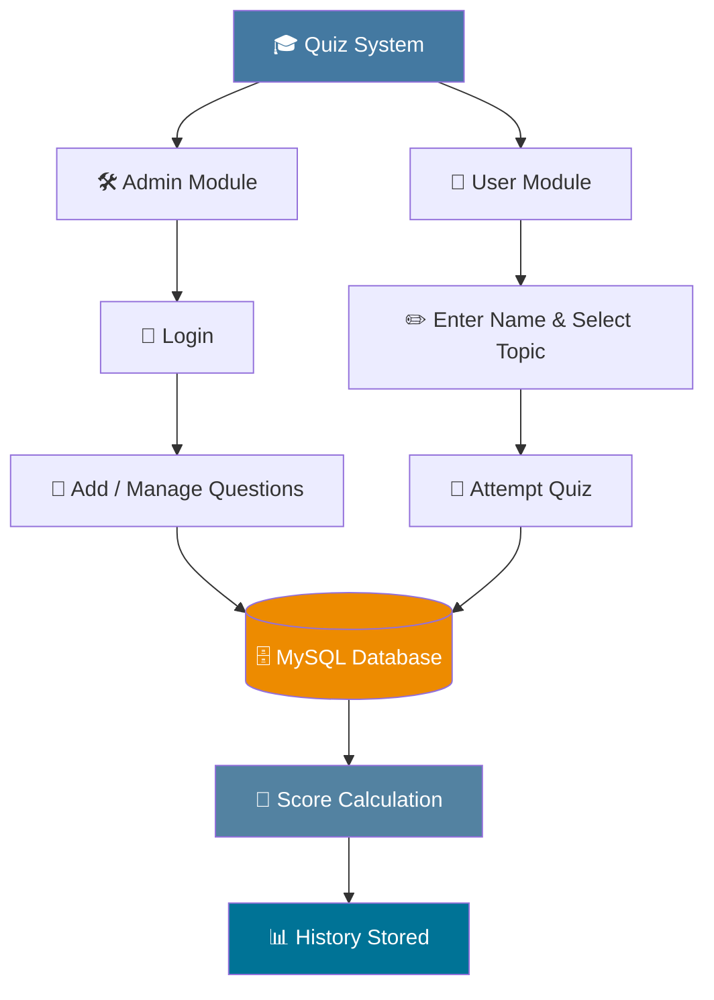

<div align="center">


<br>


<p>


</p>

<p>


</p>

<p align="center">A desktop quiz platform built with <b>Java Swing</b> and <b>MySQL</b> — question management, timed attempts, automatic scoring, and full history tracking.</p>

<sub>⭐ If this project is useful to you, consider starring the repository — it really helps!</sub>

</div>

<br>

<div align="center">

### 📚 Table of Contents

</div>

<div align="left">

• [Overview](#-overview) <br>
• [Features](#-features)   <br>
• [Tech Stack](#-tech-stack)    <br>
• [Architecture](#-architecture)    <br>
• [OOP Design](#-oop-design)   <br>
• [Screenshots](#-screenshots)   <br>
• [Project Structure](#-project-structure)   <br>
•[Installation](#-installation)  <br> 
• [Roadmap](#-roadmap)  <br>
• [Author](#-author)  <br>

</div>

<br>

## 🧭 Overview

**Quiz Management System** is a Java desktop application built as a 2nd-semester software engineering project. It gives administrators full control over a question bank while allowing users to take topic-based quizzes, get scored automatically, and review their attempt history — all backed by a normalized MySQL database.

The project was built to demonstrate applied **Object-Oriented Programming**, **Swing GUI development**, **JDBC connectivity**, and **secure SQL practices**, rather than to be a minimal classroom exercise.

<br>

## ✨ Features

<table>
<tr>
<td valign="top" width="50%">

### 🛠️ Admin
- 🔐 Authenticated admin login
- 📁 Create and manage quiz topics
- ➕ Add multiple-choice questions
- ✅ Define correct answers
- 🗄️ Question bank stored in MySQL

</td>
<td valign="top" width="50%">

### 🙋 User
- ✏️ Simple username entry
- 🎯 Topic selection
- 🧩 Interactive MCQ quiz flow
- 🧮 Automatic score calculation
- ⚡ Instant results display

</td>
</tr>
<tr>
<td valign="top">

### 📊 History
- 🕓 Per-user attempt history
- 🔎 Search by username or topic
- 💾 Persisted results in MySQL
- 🧹 Clear / reset history

</td>
<td valign="top">

### 🔒 Security
- 🧂 SHA-256 password hashing
- 🛡️ `PreparedStatement` for all queries
- ✔️ Input validation
- ⚠️ Centralized exception handling

</td>
</tr>
</table>

<br>

## 🧰 Tech Stack

<div align="left">

| Layer | Technology |
|:---:|:---:|
| Language |  |
| GUI |  |
| Database |  |
| Connectivity |  |
| Security |  |
| Architecture |  |
| Version Control |  |

</div>

<br>

## 🏗️ Architecture



<br>

## 🧩 OOP Design

<div align="center">

| Concept | Implementation |
|:---|:---|
| 🧱 **Abstraction** | `Person` defines shared structure; `role()` is left to subclasses |
| 🌳 **Inheritance** | `Admin` and `User` extend `Person` |
| 🎭 **Polymorphism** | Each subclass overrides inherited behavior |
| 🔌 **Interface** | `Attemptable` defines the quiz-attempt contract implemented by `User` |
| 📦 **Encapsulation** | Each class exposes only what's needed through defined methods |

</div>

**Core classes:** `QuizApp` · `Person` · `Admin` · `User` · `Question` · `History`

<br>

## 🖼️ Screenshots

<table>
<tr>
<td align="center"><br><sub><b>🏠 Home Screen</b></sub></td>
<td align="center"><br><sub><b>🔐 Admin Login</b></sub></td>
</tr>
<tr>
<td align="center"><br><sub><b>📁 Question Management</b></sub></td>
<td align="center"><br><sub><b>🙋 User Interface</b></sub></td>
</tr>
<tr>
<td align="center"><br><sub><b>🧩 Quiz Interface</b></sub></td>
<td align="center"><br><sub><b>🏆 Quiz Result</b></sub></td>
</tr>
<tr>
<td align="center"><br><sub><b>📊 Quiz History</b></sub></td>
<td align="center"><br><sub><b>🔎 History Search</b></sub></td>
</tr>
</table>

<br>

## 📂 Project Structure

```
quiz-management-system/
├── QuizApp.java
├── Topic.sql
├── admin.sql
├── questions.sql
├── history.sql
├── .gitignore
└── README.md
```

<div align="center">

**Database (`quizapp`)** — `admin` · `user` · `topic` · `question` · `history`

</div>

<br>

## ⚙️ Installation

<details open>
<summary><b>Click to expand setup steps</b></summary>

<br>

```bash
git clone https://github.com/Majid-Ali01/quiz-management-system.git
```

1. 🗄️ Import the `.sql` files into a MySQL 8.0+ instance to create the schema.
2. 🔧 Update the JDBC connection string, username, and password in `QuizApp.java`.
3. ▶️ Compile and run `QuizApp.java` in your preferred Java IDE or via CLI.

</details>

<br>

## 🗺️ Roadmap

- [ ] 🎨 Modernized, responsive GUI
- [ ] ⏱️ Countdown timer per quiz
- [ ] 🔀 Randomized questions & answer order
- [ ] 👤 Full user registration & authentication
- [ ] ✏️ Edit / delete existing questions
- [ ] 📈 Graphical performance analytics
- [ ] 📄 PDF export of results
- [ ] 🏆 Leaderboard system
- [ ] 🌐 Web-based version

<br>

## 👤 Author

<div align="center">

**Majid Ali**
*Software Engineering Student*


<sub>Built with ❤️ using Java · MySQL · JDBC · OOP</sub>

</div>
