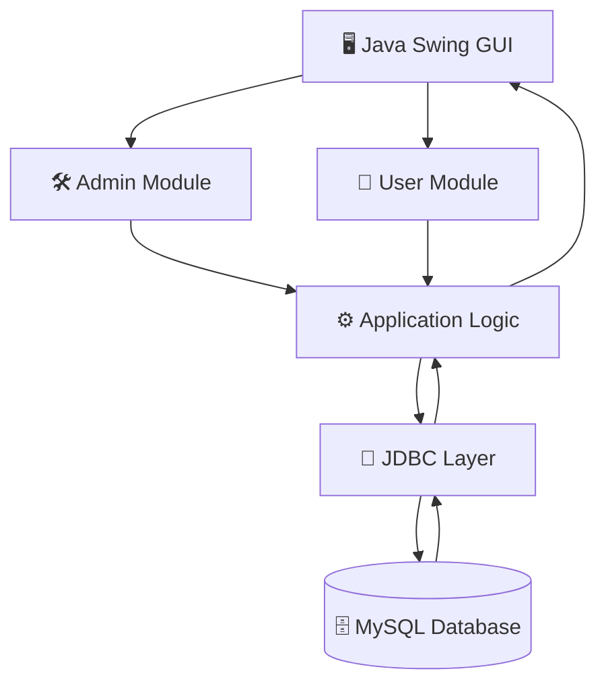

<div align="center">

# 🎯 Quiz Management System

### Java Desktop Application • OOP • Swing • JDBC • MySQL

<p>
  
  
  
  
</p>

<p>
  
  
  
</p>

<p>
  <strong>A database-driven desktop quiz platform built with Java Swing and MySQL.</strong>
</p>

<p>
  The application provides separate administrative and user workflows,
  topic-based quizzes, automated scoring, and persistent attempt history.
</p>

<br/>

<a href="#-overview">Overview</a> • <a href="#-features">Features</a> • <a href="#-architecture">Architecture</a> • <a href="#-screenshots">Screenshots</a> • <a href="#-installation">Installation</a> • <a href="#-future-improvements">Roadmap</a>

</div>

---

## 📌 Overview

**Quiz Management System** is a Java-based desktop application developed as a Software Engineering academic project.

The system combines **Object-Oriented Programming, graphical user interface development, relational database management, and JDBC-based database connectivity** into a complete working application.

The application is designed around two primary workflows:

* **Administrator** — manages topics, questions, answers, and quiz data.
* **User** — selects a topic, attempts an MCQ quiz, receives an automatically calculated score, and reviews previous attempts.

The project focuses on applying software engineering concepts in a practical environment rather than implementing only isolated programming exercises.

---

## ✨ Features

### 🔐 Authentication & Access Control

* Administrator authentication
* Separate administrative and user workflows
* Password handling with hashing
* Input validation
* Controlled access to management operations

### 🛠️ Administration

* Create and manage quiz topics
* Add multiple-choice questions
* Define answer options
* Define correct answers
* Maintain the question bank
* Store quiz data persistently in MySQL

### 🎓 Quiz Experience

* Topic-based quiz selection
* Interactive MCQ interface
* Question-by-question workflow
* Automatic answer evaluation
* Automatic score calculation
* Immediate result presentation

### 📊 History & Results

* Store completed quiz attempts
* Associate results with users/topics
* Search quiz history
* Review previous results
* Clear/reset history where required

### 🛡️ Database & Security Practices

* JDBC-based database communication
* `PreparedStatement` for parameterized SQL queries
* SHA-256 password hashing
* Input validation
* Centralized database exception handling
* Persistent relational data storage

---

# 🧰 Technologies

| Category                | Technology                                   |
| ----------------------- | -------------------------------------------- |
| Programming Language    | Java 17+                                     |
| GUI Framework           | Java Swing                                   |
| Database                | MySQL 8.0+                                   |
| Database Connectivity   | JDBC                                         |
| Programming Paradigm    | Object-Oriented Programming                  |
| Security                | SHA-256                                      |
| Version Control         | Git / GitHub                                 |
| Development Environment | IntelliJ IDEA / VS Code / Eclipse / Terminal |

---

# 🏗️ Architecture

The application follows a modular structure where the GUI communicates with application logic, which in turn communicates with the relational database through JDBC.



### Application Flow

```text
User / Admin
      │
      ▼
Java Swing Interface
      │
      ▼
Application Logic
      │
      ▼
JDBC
      │
      ▼
MySQL Database
```

This separation makes the system easier to understand, maintain, and extend.

---

# 🧠 OOP Design

The project demonstrates the major principles of Object-Oriented Programming.

| OOP Concept       | Implementation                                                          |
| ----------------- | ----------------------------------------------------------------------- |
| **Encapsulation** | Classes encapsulate their data and expose functionality through methods |
| **Inheritance**   | `Admin` and `User` inherit common properties/behavior from `Person`     |
| **Polymorphism**  | Subclasses provide their own implementations of inherited behavior      |
| **Abstraction**   | Common behavior is defined at a higher level where appropriate          |
| **Interface**     | `Attemptable` defines behavior required for quiz participation          |

### Core Classes

```text
QuizApp
│
├── Person
│   ├── Admin
│   └── User
│
├── Question
├── History
└── Attemptable
```

---

# 🗄️ Database Design

The application uses a relational MySQL database named:

```text
quizapp
```

### Main Tables

```text
┌───────────────┐
│     admin     │
├───────────────┤
│ id            │
│ username      │
│ password      │
└───────────────┘

┌───────────────┐
│     user      │
├───────────────┤
│ id            │
│ username      │
└───────────────┘

┌───────────────┐
│     topic     │
├───────────────┤
│ id            │
│ name          │
└───────────────┘

┌────────────────────┐
│      question      │
├────────────────────┤
│ id                 │
│ topic_id           │
│ question_text      │
│ option_a           │
│ option_b           │
│ option_c           │
│ option_d           │
│ correct_answer     │
└────────────────────┘

┌────────────────────┐
│      history       │
├────────────────────┤
│ id                 │
│ username           │
│ topic              │
│ score              │
│ attempt_date       │
└────────────────────┘
```

The SQL schema is included in the repository so that the application can be reproduced on another development machine.

---

# 📸 Screenshots

## 🏠 Application Interface

<table>
<tr>
<td align="center" width="50%">


<b>Home Screen</b>

</td>

<td align="center" width="50%">


<b>Admin Login</b>

</td>
</tr>

<tr>
<td align="center">


<b>Question Management</b>

</td>

<td align="center">


<b>User Interface</b>

</td>
</tr>

<tr>
<td align="center">


<b>Quiz Interface</b>

</td>

<td align="center">


<b>Quiz Result</b>

</td>
</tr>

<tr>
<td align="center">


<b>Quiz History</b>

</td>

<td align="center">


<b>History Search</b>

</td>
</tr>
</table>

---

# 📂 Project Structure

```text
quiz-management-system/
│
├── QuizApp.java
│
├── admin.sql
├── Topic.sql
├── questions.sql
├── history.sql
│
├── .gitignore
└── README.md
```

### Database Scripts

| File            | Purpose                   |
| --------------- | ------------------------- |
| `admin.sql`     | Administrator data/schema |
| `Topic.sql`     | Quiz topic data           |
| `questions.sql` | Question bank             |
| `history.sql`   | Quiz attempt history      |

---

# ⚙️ Installation

## 1. Prerequisites

Make sure the following software is installed:

* Java JDK 17 or later
* MySQL Server 8.0 or later
* MySQL Workbench
* MySQL Connector/J
* Git

Verify Java:

```bash
java -version
```

Verify the Java compiler:

```bash
javac -version
```

---

## 2. Clone the Repository

```bash
git clone https://github.com/Majid-Ali01/quiz-management-system.git
```

Navigate into the project:

```bash
cd quiz-management-system
```

---

## 3. Create the Database

Open MySQL Workbench and create the database:

```sql
CREATE DATABASE quizapp;
```

Select it:

```sql
USE quizapp;
```

Import/run the provided SQL files:

```text
admin.sql
Topic.sql
questions.sql
history.sql
```

---

# 🔌 JDBC Configuration

The application requires MySQL Connector/J.

Example connection configuration:

```java
String url = "jdbc:mysql://localhost:3306/quizapp";
String username = "root";
String password = "YOUR_PASSWORD";
```

Update the credentials according to your local MySQL installation.

> **Security note:** Do not commit real database passwords, API keys, or other credentials to GitHub.

For a production-oriented implementation, database credentials should be supplied through environment variables or an external configuration file.

---

# ▶️ How to Run

## Using an IDE

1. Open the project in your preferred Java IDE.
2. Add MySQL Connector/J to the project classpath.
3. Make sure MySQL Server is running.
4. Verify the database configuration.
5. Run:

```text
QuizApp.java
```

---

## Using Command Line

Compile:

```bash
javac -cp ".;mysql-connector-j-9.6.0.jar" QuizApp.java
```

Run:

```bash
java -cp ".;mysql-connector-j-9.6.0.jar" QuizApp
```

> On Linux/macOS, replace `;` with `:` in the classpath.

---

# 🔐 Security Considerations

The project demonstrates several important security-oriented programming practices:

### Parameterized Queries

SQL operations use `PreparedStatement` instead of directly concatenating user input.

```java
PreparedStatement ps =
    connection.prepareStatement(
        "SELECT * FROM admin WHERE username = ?"
    );

ps.setString(1, username);
```

This helps reduce the risk of SQL injection.

### Password Hashing

Passwords are processed using SHA-256 rather than being stored directly as plain text.

For a production application, a dedicated password hashing algorithm such as **Argon2, bcrypt, or scrypt** would be preferable.

---

# 🧪 Testing

The application can be tested through the following scenarios:

| Test Area           | Example                                     |
| ------------------- | ------------------------------------------- |
| Authentication      | Valid/invalid admin credentials             |
| Input Validation    | Empty username or question fields           |
| Question Management | Add valid MCQ                               |
| Quiz Flow           | Select topic and attempt quiz               |
| Scoring             | Verify correct/incorrect answer calculation |
| Database            | Verify records are persisted                |
| History             | Search and retrieve previous attempts       |
| Error Handling      | Database unavailable / invalid input        |

---

# 🧠 What I Learned

Developing this project helped me move from individual programming exercises toward building a complete application.

### Technical Skills

* Java Object-Oriented Programming
* Class design and relationships
* Inheritance and polymorphism
* Interfaces and abstraction
* Java Swing GUI development
* JDBC database connectivity
* MySQL relational database design
* SQL queries
* Prepared statements
* Exception handling
* Git and GitHub workflow

### Software Engineering Skills

* Breaking a problem into modules
* Designing application workflows
* Connecting frontend logic with persistent storage
* Structuring a database-backed application
* Debugging integration problems
* Writing technical documentation
* Managing source code with Git

---

# 🚀 Future Improvements

The following improvements could move the project closer to a production-style application:

* [ ] Modern JavaFX-based user interface
* [ ] Maven or Gradle build system
* [ ] MVC architecture
* [ ] Repository/DAO layer
* [ ] Connection pooling
* [ ] Secure password hashing with Argon2/bcrypt
* [ ] Environment-based database configuration
* [ ] User registration and authentication
* [ ] Question editing and deletion
* [ ] Randomized questions
* [ ] Randomized answer options
* [ ] Configurable quiz timer
* [ ] Performance analytics
* [ ] Leaderboard
* [ ] PDF result generation
* [ ] Automated unit and integration tests
* [ ] CI/CD with GitHub Actions
* [ ] Web-based version using Spring Boot

---

# 📈 Project Evolution

The current version focuses on demonstrating core Java, OOP, GUI, JDBC, and database concepts.

A potential production-oriented evolution would be:

```text
Current
   │
   ▼
Java Swing + JDBC + MySQL
   │
   ▼
MVC Architecture
   │
   ▼
DAO / Repository Pattern
   │
   ▼
Maven / Gradle
   │
   ▼
Automated Testing
   │
   ▼
GitHub Actions / CI
   │
   ▼
Spring Boot REST API
   │
   ▼
Web / Cloud Deployment
```

This roadmap reflects how the project could evolve from an academic desktop application into a more scalable software system.

---

# 📚 Key Concepts Demonstrated

```text
Java
 ├── Classes & Objects
 ├── Encapsulation
 ├── Inheritance
 ├── Polymorphism
 ├── Abstraction
 └── Interfaces

Database
 ├── MySQL
 ├── SQL
 ├── Relational Data
 └── JDBC

Software Engineering
 ├── Modular Design
 ├── Input Validation
 ├── Exception Handling
 ├── Security Practices
 ├── Version Control
 └── Documentation
```

---

# 🌱 Academic Context

**Project Type:** Academic Software Engineering Project
**Development Stage:** Undergraduate
**Primary Focus:** Java OOP + Database Application Development

The project was developed to demonstrate practical implementation of concepts learned during undergraduate Software Engineering studies.

---

# 👨‍💻 Author

<div align="center">

## Majid Ali

**Software Engineering Student**

Interested in:

`Software Engineering` • `Java` • `Backend Development` • `Cybersecurity` • `Database Systems`

<br/>

<a href="https://github.com/Majid-Ali01">

</a>

<a href="https://www.linkedin.com/in/majid-ali-3027b03ab/">

</a>

</div>

---

# ⭐ Support

If you found this project useful or interesting, consider giving the repository a ⭐.

Your feedback and suggestions are welcome.

---

<div align="center">

### Built with Java • MySQL • JDBC • Swing • OOP

**From academic concepts → practical software**

</div>
