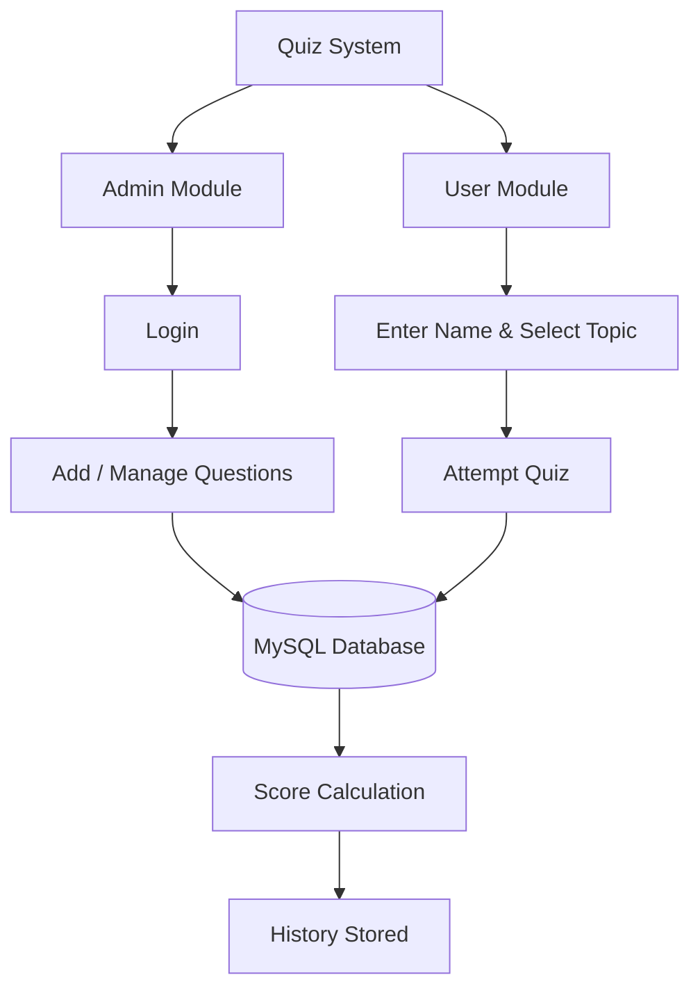

<div align="center">


<br>


<p align="center">A desktop quiz platform built with Java Swing and MySQL — question management, timed attempts, automatic scoring, and full history tracking.</p>

<sub>⭐ If this project is useful to you, consider starring the repository.</sub>

</div>

<br>

## Table of Contents

- [Overview](#overview)
- [Features](#features)
- [Tech Stack](#tech-stack)
- [Architecture](#architecture)
- [OOP Design](#oop-design)
- [Screenshots](#screenshots)
- [Project Structure](#project-structure)
- [Installation](#installation)
- [Roadmap](#roadmap)
- [Author](#author)

<br>

## Overview

**Quiz Management System** is a Java desktop application built as a 2nd-semester software engineering project. It gives administrators full control over a question bank while allowing users to take topic-based quizzes, get scored automatically, and review their attempt history — all backed by a normalized MySQL database.

The project was built to demonstrate applied **Object-Oriented Programming**, **Swing GUI development**, **JDBC connectivity**, and **secure SQL practices**, rather than to be a minimal classroom exercise.

<br>

## Features

<table>
<tr>
<td valign="top" width="50%">

**Admin**
- Authenticated admin login
- Create and manage quiz topics
- Add multiple-choice questions
- Define correct answers
- Question bank stored in MySQL

</td>
<td valign="top" width="50%">

**User**
- Simple username entry
- Topic selection
- Interactive MCQ quiz flow
- Automatic score calculation
- Instant results display

</td>
</tr>
<tr>
<td valign="top">

**History**
- Per-user attempt history
- Search by username or topic
- Persisted results in MySQL
- Clear / reset history

</td>
<td valign="top">

**Security**
- SHA-256 password hashing
- `PreparedStatement` for all queries
- Input validation
- Centralized exception handling

</td>
</tr>
</table>

<br>

## Tech Stack

| Layer | Technology |
|---|---|
| Language | Java |
| GUI | Java Swing |
| Database | MySQL 8.0+ |
| Connectivity | JDBC |
| Security | SHA-256 hashing |
| Architecture | Object-Oriented Programming |
| Version Control | Git & GitHub |

<br>

## Architecture



<br>

## OOP Design

| Concept | Implementation |
|---|---|
| **Abstraction** | `Person` defines shared structure; `role()` is left to subclasses |
| **Inheritance** | `Admin` and `User` extend `Person` |
| **Polymorphism** | Each subclass overrides inherited behavior |
| **Interface** | `Attemptable` defines the quiz-attempt contract implemented by `User` |
| **Encapsulation** | Each class exposes only what's needed through defined methods |

**Core classes:** `QuizApp` · `Person` · `Admin` · `User` · `Question` · `History`

<br>

## Screenshots

<table>
<tr>
<td align="center"><br><sub>Home Screen</sub></td>
<td align="center"><br><sub>Admin Login</sub></td>
</tr>
<tr>
<td align="center"><br><sub>Question Management</sub></td>
<td align="center"><br><sub>User Interface</sub></td>
</tr>
<tr>
<td align="center"><br><sub>Quiz Interface</sub></td>
<td align="center"><br><sub>Quiz Result</sub></td>
</tr>
<tr>
<td align="center"><br><sub>Quiz History</sub></td>
<td align="center"><br><sub>History Search</sub></td>
</tr>
</table>

<br>

## Project Structure

```
quiz-management-system/
├── QuizApp.java
├── Topic.sql
├── admin.sql
├── questions.sql
├── history.sql
├── .gitignore
└── README.md
```

**Database (`quizapp`)** — `admin` · `user` · `topic` · `question` · `history`

<br>

## Installation

```bash
git clone https://github.com/Majid-Ali01/quiz-management-system.git
```

1. Import the `.sql` files into a MySQL 8.0+ instance to create the schema.
2. Update the JDBC connection string, username, and password in `QuizApp.java`.
3. Compile and run `QuizApp.java` in your preferred Java IDE or via CLI.

<br>

## Roadmap

- [ ] Modernized, responsive GUI
- [ ] Countdown timer per quiz
- [ ] Randomized questions & answer order
- [ ] Full user registration & authentication
- [ ] Edit / delete existing questions
- [ ] Graphical performance analytics
- [ ] PDF export of results
- [ ] Leaderboard system
- [ ] Web-based version

<br>

## Author

**Majid Ali**
Software Engineering Student

<div align="center">
<sub>Built with Java · MySQL · JDBC · OOP</sub>
</div>
